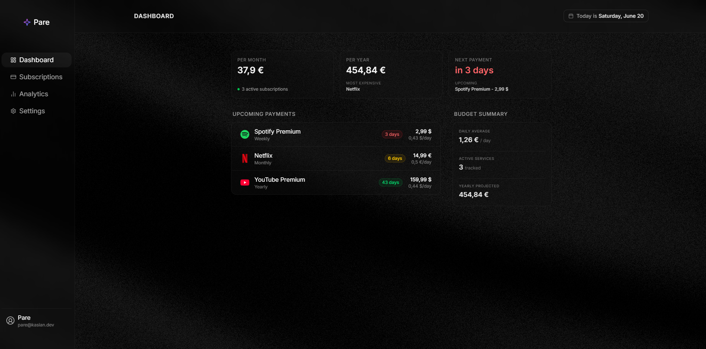
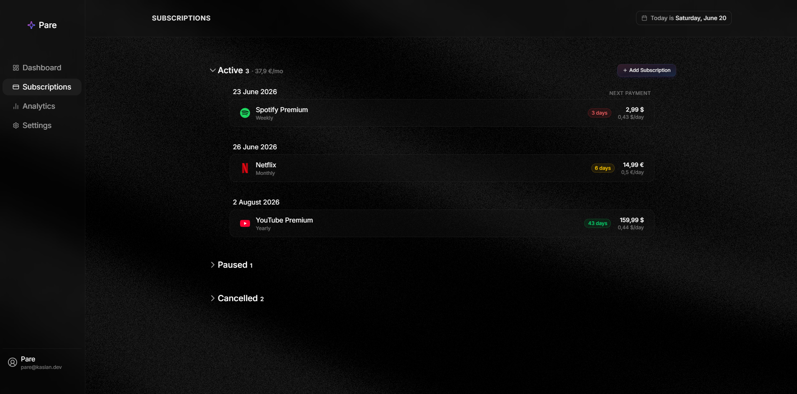

# Pare

> You probably pay for more than you think.

A subscription manager I built to track what I'm actually spending on recurring services — designed with an backend clean architecture, background processing, and a comprehensive security audit.

---

## What it does

<p>
  
  
</p>

- Track subscriptions across different billing cycles (monthly, yearly, weekly)
- Multi-currency support with live exchange rates (proxied through the backend)
- Email reminders 3 days before a renewal
- Analytics: monthly spend, yearly projection, billing cycle breakdown
- Dashboard with upcoming payments sorted by date

---

## Stack

**Backend** — ASP.NET Core 10, Clean Architecture (`Domain` / `Application` / `Infrastructure` / `API`), CQRS with MediatR, FluentValidation, EF Core + PostgreSQL 18, Hangfire for background jobs, Serilog, Resend for transactional email

**Frontend** — React 19 + Vite + TypeScript, Tailwind CSS v4, React Query, Zustand, Recharts, React Router v7

**Infra** — Docker Compose (base / override / prod), Caddy as a reverse proxy with automatic TLS, GitHub Actions CI, Hetzner VPS

---

## Architecture

```
Pare.Domain          → Entities, enums, core logic
Pare.Application     → CQRS handlers, validators, interfaces, services
Pare.Infrastructure  → EF Core, repositories, JWT, BCrypt, email, jobs
Pare.API             → Controllers, middleware, DI wiring
```

Clean Architecture means the domain doesn't know about EF Core, the application layer doesn't know about ASP.NET, and everything flows inward. The `Application` layer defines interfaces; `Infrastructure` implements them.

CQRS is done with MediatR. Every feature is a command or a query — validators are co-located with their command, DTOs are mapped manually (no AutoMapper).

---

## Auth

JWT access tokens (15 min expiry) + rotating refresh tokens via `httpOnly` cookies. Refresh tokens are hashed with SHA-256 before storage — a plain-text token in the DB would mean a leak = direct session hijack. The frontend has a request queue that handles concurrent 401s without firing multiple refresh requests.

---

## Running locally

**Prerequisites:** Docker, .NET 10 SDK (for local dev without Docker)

```bash
git clone https://github.com/shimiio/pare
cd pare

cp .env.example .env
# fill in the values
```

```bash
# Start everything (DB, migrator, API, frontend, Caddy)
docker compose -f docker-compose.yml -f docker-compose.override.yml up --build
```

The override file swaps Resend for Mailpit (local SMTP) and exposes the DB port. Email UI is at `http://localhost:8025`.

For local backend dev without Docker, fill in `backend/src/Pare.API/appsettings.Development.json` and run:

```bash
cd backend && dotnet run --project src/Pare.API
cd frontend && pnpm install && pnpm dev
```

**Environment variables** — see `.env.example` and `secrets.example.json` for what's needed.

---

## Tests

```bash
# Backend
dotnet test backend/

# Frontend
cd frontend && pnpm test:run
```

Backend: xUnit + Moq + FluentAssertions — unit tests for domain logic (billing date calculation), validators, and service behavior.

Frontend: Vitest — utility functions for date calculations, currency formatting, error extraction.

---

## Security

Before going live I ran a structured pen test covering the full OWASP Top 10 (2025) — automated scanning with OWASP ZAP + manual testing from a Kali Linux machine. 13 findings total, 10 fixed before deployment.

Key things that got caught and fixed:
- Refresh tokens stored as plain text → SHA-256 hashed
- No rate limiting on auth endpoints → brute-forced a weak test password with `rockyou.txt` in under a minute
- Exchange rate API key in the Vite bundle → moved server-side with 24h cache
- Missing security headers → added via Caddy config

Full writeup in [`SECURITY_AUDIT.md`](./SECURITY_AUDIT.md).

---

## Deployment

Hetzner VPS, Caddy handles TLS automatically. Three-Compose-file setup:

```bash
docker compose \
  -f docker-compose.yml \
  -f docker-compose.prod.yml \
  up -d --build
```

Migrations run as a dedicated `migrator` container that exits cleanly before the API starts. This is the correct pattern for production EF Core migrations — `MigrateAsync()` applies existing migrations, it doesn't generate them.

---

## What I'd do differently / what's next

- More unit tests and add integrations tests
- Email verification + password reset (deferred to keep scope sane)
- PaymentHistory feature — planned as the first post-launch migration, deliberately, to get real experience with live schema changes
- Race condition on the subscription limit — concurrent requests can exceed 50. Fix requires a DB-level constraint or pessimistic locking. Documented in the security audit as accepted risk for now.

---

Built by [Pavlo](https://github.com/shimiio)
